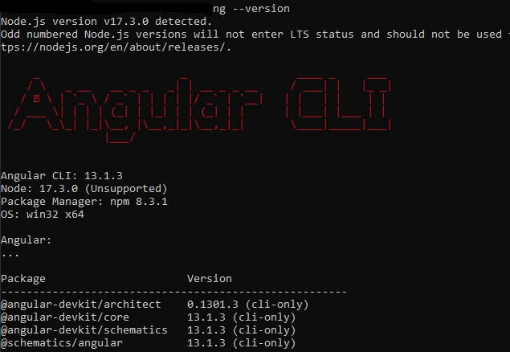

<h1> Sala de Reuniões com Java e Angular </h1>

Este projeto foi desenvolvido em aula proporcionada pela Digital Innovation One, através da desenvolvedora
Kamila Santos.

Foi desenvolvida uma API para ser consumida em projeto desenvolvido no Angular.
Trata-se de um projeto bastante simples mas que permite compreender  bem o funcionamento do cosnumo de uma API pelo front.
Seguem as versões utilizadas no desenvolvimento do front:

Em relação ao projeto desenvolvido em aula, fiz as seguintes alterações:

- Utilizei o MySQL para as APIs, alterando as configurações originais para isso, apenas por preferência;
- Inclusão desta rota: { path: '**', component: RoomListComponent } para que vá para a Room Lista quando for informado qualquer endpoint não roteado;
- Inclusão do botão BackToRoomList também quando acessadas as opções AddRoom e Update (já tinha o método gotoList() com o "router.navigate", mas por algum problema não constava do HTML original; 
- 

JSON - Documentação:

Seguem alguns JSON utilizados para teste da APIs (mas os registros podem ser efetuados diretamente pelo navegador, após iniciar a parte front do projeto):

localhost:{PORTA}/api/v1/rooms (GET)

localhost:{PORTA}/api/v1/rooms/1 (GET)/Por Id

localhost:{PORTA}/api/v1/rooms (POST)
{
"name":"java",
"date": "10/05/2020",
"startHour":"20hs",
"endHour":"23hs"   
}

localhost:{PORTA}/api/v1/rooms/1 (PUT)
{
"name":"java alterado",
"date": "10/05/2020",
"startHour":"20hs",
"endHour":"23hs"   
}

localhost:{PORTA}/api/v1/rooms/1 (DELETE)/Por Id

Pré-requisitos para a execução do projeto:

- Java 11.
- Maven 3.6.3 ou versões superiores.
- Intellj IDEA Community Edition ou outra IDE.
- Para a parte do Angular, ver imagem acima e, além disso acrescentar a dependência a seguir:
  
  ng add @angular/material (observando que são importadas em "material.module.ts").
- 

